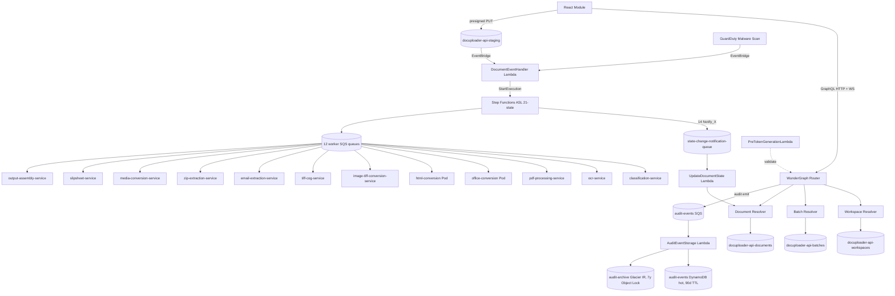
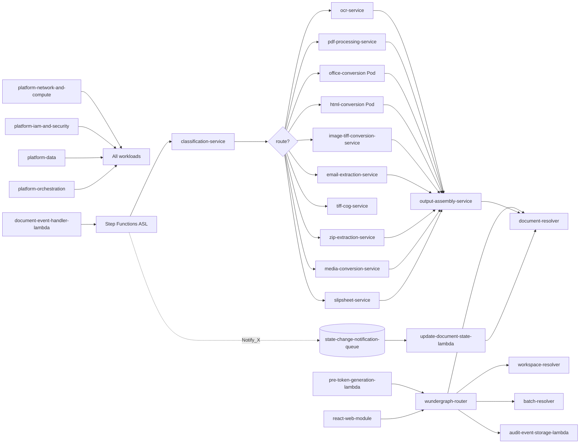

# Application Design: Unified Document Uploader

## 1. Architectural Overview

Three tiers, one orchestration backbone, one observability stack:

- **API tier**: WunderGraph router → 3 Go gRPC resolvers (Workspace, Batch, Document) → 4 Go Lambdas (`PreTokenGenerationLambda`, `DocumentEventHandler`, `UpdateDocumentState`, `AuditEventStorage`). Public protocol: GraphQL over HTTP (queries/mutations) and `graphql-transport-ws` WebSocket (subscriptions).
- **Pipeline tier**: independently-scaling EKS workers, one per processing route or sub-route, fed by SQS Claim-Check messages from a Step Functions Standard state machine. Sidecar-pattern Pods for Office (Aspose + Python orchestrator) and HTML (Gotenberg + TS orchestrator) conversion.
- **Web tier**: embeddable TypeScript React module fronting the GraphQL API.
- **Orchestration backbone**: Step Functions Standard 21-state ASL with 14 fire-and-forget `Notify_<X>` interstitials → `state-change-notification-queue` → `UpdateDocumentState` Lambda → Document resolver.
- **Observability stack**: OpenTelemetry over OTLP → sandbox-resident Grafana Alloy → Grafana Cloud (logs, metrics, traces). W3C Trace Context on every internal hop.

### 1.1 Architecture diagram

---

## 2. Component Inventory

### 2.1 API tier components

| Component | Type | Language | Key responsibilities |
| --- | --- | --- | --- |
| `wundergraph-router` | EKS Deployment | Go | GraphQL composition, schema serving, subscription fan-out, audit-event emission via custom module |
| `workspace-resolver` | EKS Deployment | Go | `Workspace` CRUD + per-workspace KMS-alias creation (A27); calls into KMS for alias provisioning on `createWorkspace` |
| `batch-resolver` | EKS Deployment | Go | `Batch` CRUD + state transitions |
| `document-resolver` | EKS Deployment | Go | `Document` CRUD + `createDocument` (presigned URL minting) + `updateDocumentStatus` (idempotency-keyed); `Document.statusChanged` subscription resolver |
| `pre-token-generation-lambda` | Lambda (Sync) | Go | OIDC token validation; custom-claim assertion (`userID`, `workspaceID`, `tenantId`); re-pointable at a future Opus 2 IdP without code change |
| `document-event-handler-lambda` | Lambda (Event-Driven) | Go | Drains EventBridge S3 PutObject + GuardDuty findings; starts Step Functions executions |
| `audit-event-storage-lambda` | Lambda (Event-Driven) | Go | Drains `docuploader-api-audit-events` SQS; writes to DynamoDB hot store + S3 Glacier IR cold store; partial-batch failure semantics |
| `update-document-state-lambda` | Lambda (Event-Driven) | Go | Drains `state-change-notification-queue`; calls `Document.updateDocumentStatus` with idempotency keys derived from `(executionId, toState, phase)` |

### 2.2 Pipeline tier components

| Component | Type | Language | Route(s) | Key responsibilities |
| --- | --- | --- | --- | --- |
| `classification-service` | EKS Deployment | TypeScript | All routes (pre-routing) | Magic-byte classification via `file-type` (21.x); routes to per-route worker queue |
| `ocr-service` | EKS Deployment | TypeScript | `ocr-direct` | Textract sync/async invocation; assembles OCR text layer |
| `pdf-processing-service` | EKS Deployment | Python | `convert/office` (downstream) | Page-level operations, repair (`pikepdf`), OCR text-layer assembly (`PyMuPDF`, Ghostscript) |
| `office-conversion-aspose-container` | EKS Deployment (container #1 of 2) | C++ | `convert/office` | Aspose.Total-for-C++ conversion; chunked rendering; bounded peak RAM |
| `office-conversion-orchestrator-sidecar` | EKS Deployment (container #2 of 2) | Python | `convert/office` | Worker loop, queue interaction, S3 IO, chunking strategy, qpdf streaming merge invocation |
| `html-conversion-gotenberg-container` | EKS Deployment (container #1 of 2) | Third-party | `convert/html` | Headless Chromium server; Gotenberg API. Configuration-only unit (no source code beyond Helm/Kustomize) |
| `html-conversion-typescript-sidecar` | EKS Deployment (container #2 of 2) | TypeScript | `convert/html` | Worker loop, queue interaction, Gotenberg client, output assembly |
| `image-tiff-conversion-service` | EKS Deployment | TypeScript | `convert/image`, `convert/tiff` | `sharp` + `PDFKit` for image transcode and PDF wrapping; `geotiff.js` for ranged TIFF frame extraction |
| `tiff-cog-service` | EKS Deployment | TypeScript | `convert/tiff` (preprocessor) | `gdal-async` TIFF-to-COG conversion enabling ranged extraction |
| `email-extraction-service` | EKS Deployment | Go | `email` | EML via Go stdlib (`net/mail`, `mime/multipart`); MSG via `mscfb` + `crtf`; body + attachment fan-out |
| `zip-extraction-service` | EKS Deployment | TypeScript | `archive` | Streaming ZIP extraction via `unzipper` (0.12.x); per-entry fan-out into pipeline |
| `media-conversion-service` | EKS Deployment | TypeScript | `media` | FFmpeg / FFprobe audio/video conversion |
| `slipsheet-service` | EKS Deployment | TypeScript | `slipsheet` | Deterministic slipsheet PDF generation via `pdf-lib`; template overlay |
| `output-assembly-service` | EKS Deployment | TypeScript | All routes (terminal) | Searchable PDF generation (`pdf-lib`); writes per-document output set to S3 |

### 2.3 Web tier

| Component | Type | Language | Key responsibilities |
| --- | --- | --- | --- |
| `react-web-module` | Static asset bundle | TypeScript | Upload UX, status surfacing (via `Document.statusChanged` subscription), output retrieval; **no inline preview/annotation** at MVP |

### 2.4 Platform units

| Component | Owns |
| --- | --- |
| `platform-network-and-compute` | EKS cluster integration (ConfigMaps, Namespaces, ServiceAccounts, IRSA bindings); ALB Ingress; ACM certificates; ECR repositories; K8s "service chassis" library scaffolding |
| `platform-data` | All DynamoDB tables (workspaces, batches, documents, audit-events, content-hashes, pipeline-files, textract-task-tokens); `docuploader-pipeline`, `docuploader-api-staging`, `docuploader-api-audit-archive` (Glacier IR Object Lock), `docuploader-pipeline-config` buckets; KMS keys with per-tenant aliases; S3 Lifecycle rules. **Plus**: tri-language data-access library at workspace-root `libs/data-access/{go,python,typescript}/` (typed clients + entity types for the 7 tables) consumed via Go modules / uv / pnpm. Root-level path is an explicit project-structure override per audit.md |
| `platform-orchestration` | Step Functions 21-state ASL (14 `Notify_<X>` interstitials); `docuploader-api-events` EventBridge bus + rules; 12 worker SQS queues + `state-change-notification-queue` + `docuploader-api-audit-events` (with DLQs); WunderGraph audit-emission router-side wiring |
| `platform-iam-and-security` | IAM role library (~17 roles spanning API and pipeline tiers) + IRSA bindings; GuardDuty Malware Protection for S3; Secrets Manager bootstrap (audit-archive CMK, GraphQL service-account JWT, Aspose licence skeleton) |

---

## 3. Data Model

### 3.1 DynamoDB tables

| Table | Purpose | Primary key | GSIs | TTL | Notes |
| --- | --- | --- | --- | --- | --- |
| `docuploader-api-workspaces` | Tenant identity + configuration | `workspaceId` | — | — | Source of truth for tenant identity (resolved at token-mint time). Holds `EncryptionConfig`, `pipelineConfig`, `retentionPolicy` |
| `docuploader-api-batches` | Batch envelope | `batchId` | — | — | `status` (OPEN/CLOSED) gates new `createDocument` |
| `docuploader-api-documents` | Document lifecycle | `documentId` | `idempotency-index` (HASH on idempotency key) | — | Stores `status`, `pipelineStage`, `processingError`, `outputs`. Idempotency-index enforces de-dup |
| `docuploader-api-audit-events` | Audit hot store | `eventId` (or composite per design) | per-tenant query GSI | 90 days | Drained by `AuditEventStorage` |
| `docuploader-content-hashes` | Content de-dup | `sha256` | — | 90 days | Hit-rate tracked for dedup efficiency metric |
| `docuploader-pipeline-files` | Pipeline-managed file pointers | `fileId` | `folderPath-index` | 7 days | Per-execution scratch metadata |
| `textract-task-tokens` | Async Textract callback tokens | `taskToken` | — | 1 day | Async OCR path |

### 3.2 S3 buckets

| Bucket | Purpose | Notes |
| --- | --- | --- |
| `docuploader-api-staging` | Single staging bucket for all tenants (A27 override) | Per-tenant logical isolation via KMS aliases + prefix-scoped IAM. S3 Lifecycle TTL governed by `Workspace.retentionPolicy.inputRetentionDays` (default 7d). BPA on. Deny `aws:SecureTransport=false`. SSE-KMS |
| `docuploader-pipeline` | Pipeline working storage | BPA on. SSE-KMS |
| `docuploader-api-audit-archive` | Audit cold store | Glacier IR. Object Lock Compliance, 7-year default retention. Separate operator-managed CMK |
| `docuploader-pipeline-config` | Slipsheet templates and other config | BPA on. SSE-KMS |

### 3.3 Encryption model (A27)

- Single staging bucket; per-tenant **KMS aliases** bound to a shared customer-managed key infrastructure.
- Per-workspace KMS-alias creation and prefix policy seeding live inside the `workspace-resolver` unit (called on `createWorkspace`).
- Audit-archive uses a separate operator-managed CMK distinct from per-tenant infrastructure.
- KMS key rotation cadence: 6-month default; configurable per workspace.

---

## 4. Service Contracts

### 4.1 Public API contract (GraphQL)

| Surface | Operations |
| --- | --- |
| Workspace | `createWorkspace`, `updateWorkspace`, `getWorkspace` (mutations idempotent) |
| Batch | `createBatch`, `closeBatch`, `getBatch` |
| Document | `createDocument` (returns presigned URL), `updateDocumentStatus` (idempotency-keyed), `getDocument`, `Document.statusChanged` (subscription via `graphql-transport-ws`) |

Idempotency keys are mandatory on every state-changing mutation. Schema evolution is additive-only by default.

### 4.2 Internal control plane

- **Router ↔ resolvers**: gRPC with proto3. `.proto` files committed under each resolver unit (`units/<resolver>/proto/`).
- **Sidecar ↔ container**: REST + JSON over `localhost`. Uniform error envelope `{code, message, detail, retryable, extensions}` (precise schema deferred to construction).
- **SQS messages**: every body carries `schemaVersion`; additive-backward-compatible evolution by default.
- **Step Functions task input**: carries W3C Trace Context.
- **Audit emission**: WunderGraph custom module writes one SQS message per state-changing mutation, including caller identity, request id, idempotency key, and mutation payload (with redaction rules per `tech-environment.md`).

### 4.3 Trace propagation

W3C Trace Context (`traceparent`, `tracestate`) on every internal hop: HTTP, gRPC, SQS message attributes, Step Functions task input. One trace per `Document` from `UPLOADED` to terminal state; child traces for fan-out (ZIP extraction, email re-entry).

---

## 5. State Machine (Step Functions)

21 states + 14 fire-and-forget `Notify_<X>` interstitials. After every domain state transition, an interstitial emits a state-change event to `state-change-notification-queue`, drained by `UpdateDocumentState` Lambda which writes back to `docuploader-api-documents` via the Document resolver.

**Two-Catch error pattern (binding for MVP)**:
- Per-service `DocumentProcessingError` → slipsheet-route fallback (slipsheet PDF produced with `nativeTrigger=SLIPSHEET`)
- `States.ALL` failure → `HandleError` → terminal `Failed` with `processingError` populated

Both branches must be evidenced via synthetic error-injection tests at MVP per success criteria.

---

## 6. Cross-Cutting Concerns

### 6.1 Logging

Structured JSON over OTLP. Required resource attributes per process: `service.name`, `service.version`, `service.namespace`, `deployment.environment`. Required line fields: `timestamp`, `level`, `logger`, `message`, `trace_id`, `span_id`. Required document-scoped correlation IDs: `tenant_id`, `workspace_id`, `batch_id`, `document_id`, `execution_id`, `pipeline_stage`, `request_id`, `idempotency_key`, `user_id`. Never-log set (presigned URLs, OIDC tokens, data keys, customer document content, AWS access keys, Secrets Manager values, customer-supplied PII metadata) is binding; violations are Sev-1.

### 6.2 Metrics and traces

Histograms for latency; counters for throughput / error rates / per-stage events; gauges for queue depth and pod resource utilisation. Per-route, per-tenant, per-workspace dimensions where cardinality budget allows. One trace per `Document`; per-execution joins on `executionId`; per-tenant rollups on `tenantId`/`workspaceId`.

### 6.3 Authentication

OIDC Client Credentials grant; custom claims (`userID`, `workspaceID`, `tenantId`) injected by the external issuer and validated by `pre-token-generation-lambda`. Internal service-to-service: GraphQL service-account JWT from Secrets Manager. AWS service identity: IRSA only — no static AWS credentials in cluster or code.

### 6.4 Tenant isolation

Resolved at token-mint time from `docuploader-api-workspaces`. Caller-supplied `tenantId` never trusted. Enforced at:
- API layer (resolver middleware reads token claims; never input)
- Storage layer (prefix-scoped IAM on `docuploader-api-staging`)
- KMS layer (per-tenant KMS aliases bound to a customer-managed key)

### 6.5 Rate limiting

Rate-limit guards exist on resolvers and the ALB / API surface. Specific numeric per-resolver and per-route limits deferred to construction.

---

## 7. Failure Modes and Recovery

| Failure | Behaviour |
| --- | --- |
| GuardDuty detects malware | `DocumentEventHandler` does not start a Step Functions execution; `Document.status` transitions to a scan-failure terminal state; auditable |
| Per-service `DocumentProcessingError` | Two-Catch slipsheet route generates a slipsheet output; document reaches `COMPLETED` with `nativeTrigger=SLIPSHEET` (no silent drop) |
| `States.ALL` failure | `HandleError` → terminal `Failed`; `processingError` populated; no inline retry |
| Audit SQS unreachable | `AuditEventStorage` partial-batch failure semantics; emergency fall-through to always-on `audit-fallback` CloudWatch log group |
| Idempotency-key collision on retry | `idempotency-index` GSI on `docuploader-api-documents` returns existing row; no duplicate state transition |
| KEDA scale-out lag | Per-queue oldest-message-age tracked as metric; load test evidences linear scalability |

---

## 8. Deployment Topology

- All compute in EKS (sandbox cluster pre-provisioned) and AWS Lambda (`provided.al2023` runtime for Go Lambdas).
- All AWS resources via Terraform; Kubernetes manifests via Helm + Kustomize.
- Push-based deployment (`terraform apply`, `kubectl apply`, `helm upgrade`); ArgoCD bypassed; CrossPlane not used.
- Terraform state in S3 with native S3 locking (Terraform 1.10+); no DynamoDB lock table.
- VPC endpoints for S3, DynamoDB, SQS, Step Functions, KMS, Secrets Manager, ECR (eliminates NAT egress on those calls).
- ECR for all built images.

---

## 9. Component Dependency Graph

---

## 10. Out of Application Design Scope

- Per-unit functional designs (data classes, business-rule pseudocode, message-shape specifics): produced in Construction stage `Functional Design` per unit.
- Per-unit NFR specifics (concrete latency targets, scaling triggers, RAM bounds verification harness): produced in Construction stage `NFR Requirements` / `NFR Design` per unit.
- Per-unit infrastructure (Terraform modules, Helm charts, Kustomize overlays): produced in Construction stage `Infrastructure Design` per unit.
- Code generation: produced in Construction stage `Code Generation` per unit.
