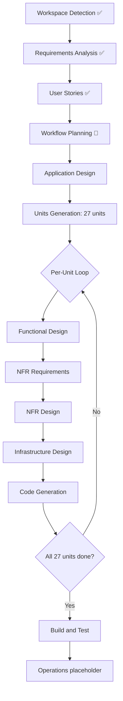
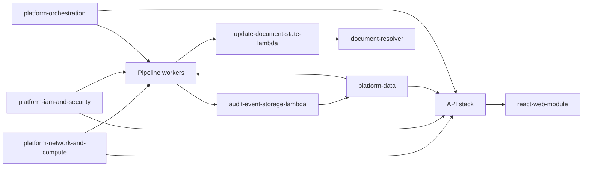

# Workflow Plan: Unified Document Uploader

## Phase Inclusion Decisions

Based on `requirements.md` (comprehensive depth; greenfield; 27-unit decomposition; SOC 2 / ISO 27001 alignment; multi-language; multi-tenant), every conditional Inception stage is **executed** and every Construction stage is **executed per unit**. Reverse Engineering is **skipped** (greenfield, no existing code).

| Stage | Status | Depth | Rationale |
| --- | --- | --- | --- |
| Workspace Detection | ✅ Done | — | Greenfield confirmed; no existing code |
| Reverse Engineering | ⛔ Skipped | — | Greenfield |
| Requirements Analysis | ✅ Done | Comprehensive | 42 verification questions ratified; `requirements.md` produced |
| User Stories | ✅ Done | Standard | 4 MVP journeys + 2 full-vision journeys mapped to 7 personas; 14 stories across 7 epics |
| Workflow Planning | 🔵 This document | — | — |
| Application Design | ⏭ Next | Comprehensive | New components/services; component methods and business rules need definition; service layer required; dependencies need clarification |
| Units Generation | ⏭ After App Design | Comprehensive | System needs decomposition into 27 units (binding per `tech-environment.md`); multi-language; complex |

| Construction Stage | Per-Unit Status | Rationale |
| --- | --- | --- |
| Functional Design | Executed per unit | New data models (3 DynamoDB tables), complex business logic (Two-Catch, idempotency, chunking) |
| NFR Requirements | Executed per unit | Performance (chunked RAM bound), security, scalability concerns; tech stack already chosen per unit but NFR specifics need per-unit work |
| NFR Design | Executed per unit | NFR Requirements executed; patterns need incorporation |
| Infrastructure Design | Executed per unit | Per-unit Terraform + Helm + Kustomize; deployment architecture required |
| Code Generation | Executed per unit | Always-execute |
| Build and Test | Executed once after all units | Three-tier gate (local + LocalStack + sandbox), Allure reports, property-based tests |

---

## Workflow Visualization (Mermaid)

---

## Construction Sequence

### Tier-1 (build first): platform substrate

The four platform units must complete before any software unit can integrate end-to-end:

1. `platform-network-and-compute` — EKS integration, ALB, ACM, ECR, K8s service chassis
2. `platform-iam-and-security` — IAM role library (~17 roles), IRSA bindings, GuardDuty config, Secrets Manager bootstrap
3. `platform-data` — DynamoDB tables, S3 buckets (staging + audit-archive + pipeline + pipeline-config), KMS keys + aliases, S3 lifecycle
4. `platform-orchestration` — Step Functions ASL (21-state), EventBridge bus, SQS queues (12 worker + state-change + audit), WunderGraph audit-emission wiring

Rationale: every API/pipeline unit binds to IAM roles, KMS keys, DynamoDB tables, SQS queues, and the ASL. Building software units against missing infrastructure produces churn.

### Tier-2: API stack

Built in parallel after Tier-1 substrate exists:

5. `wundergraph-router`
6. `workspace-resolver`
7. `batch-resolver`
8. `document-resolver`
9. `pre-token-generation-lambda`
10. `document-event-handler-lambda`
11. `audit-event-storage-lambda`

Rationale: API tier exposes the GraphQL surface required by every customer-facing journey and by the React module. The audit-storage Lambda depends on platform-orchestration's audit SQS queue and platform-data's audit DynamoDB/Glacier sinks.

### Tier-3: pipeline workers

Built in parallel after Tier-1 substrate; each binds to its own SQS queue and emits state-change events:

12. `classification-service`
13. `ocr-service`
14. `zip-extraction-service`
15. `pdf-processing-service`
16. `office-conversion-aspose-container` + `office-conversion-orchestrator-sidecar` (sidecar-pattern Pod, container pair)
17. `html-conversion-gotenberg-container` + `html-conversion-typescript-sidecar` (sidecar-pattern Pod, container pair)
18. `tiff-cog-service`
19. `image-tiff-conversion-service`
20. `email-extraction-service`
21. `media-conversion-service`
22. `slipsheet-service`
23. `output-assembly-service`
24. `update-document-state-lambda` (drains `state-change-notification-queue`)

### Tier-4: web

25. `react-web-module` — embeddable TypeScript module fronting the GraphQL API; static asset bundle

---

## Critical Dependencies (illustrative graph)

---

## Parallelisation Strategy

With six senior engineers (each competent in ≥2 of Go/Python/TS/C++ + K8s/AWS/GraphQL), the construction phase parallelises as follows:

| Workstream | Lead languages | Units |
| --- | --- | --- |
| Platform substrate (Tier-1) | Terraform + Go | 4 platform units |
| API stack (Tier-2) | Go | 7 API units |
| Office route (Tier-3) | C++ + Python | 2 units (Aspose + orchestrator) |
| HTML route (Tier-3) | TypeScript + Helm | 2 units (Gotenberg config + TS sidecar) |
| Image/TIFF route (Tier-3) | TypeScript | 3 units (image-tiff + tiff-cog + output-assembly) |
| Email + Archive routes (Tier-3) | Go + TypeScript | 2 units |
| OCR + Slipsheet + Media + Classification + PDF (Tier-3) | Mixed | 5 units |
| Pipeline state lifecycle (Tier-3) | Go | 1 Lambda |
| Web (Tier-4) | TypeScript | 1 unit |

Tier-1 is on the critical path; downstream tiers parallelise once Tier-1 is up.

---

## Build and Test Sequencing

Three-tier test gate per unit (Local + LocalStack + Sandbox) means each unit must complete its full test gate before being "done". Recommended sequencing:

1. **Per-unit Local + LocalStack** — gated by unit completion; run on every PR
2. **Sandbox-deployed** — gated post-merge to main; run nightly per unit
3. **End-to-end journey tests against the four MVP journeys** — run after all 27 units pass their sandbox gate
4. **Linear-scalability load injection** — final gate before sign-off; provides the hard pass/fail evidence for NFR-1.1

---

## Risks and Mitigations (workflow-specific)

| Risk | Mitigation |
| --- | --- |
| Tier-1 platform substrate slips → all downstream blocked | Front-load platform team; build platform-iam-and-security and platform-data in parallel where IAM/data ownership permits |
| Aspose chunking RAM bound fails under load | Property-based RAM-bound test goes in early; slipsheet fallback guarantees no document is silently dropped |
| Sandbox capacity insufficient for linear-scalability evidence | Document the sandbox-capacity cut-off explicitly; treat as accepted limitation if reached |
| LocalStack gaps for Textract / GuardDuty | Mock at SDK boundary for local-integration; rely on sandbox tier for real-AWS evidence |

---

## Stage Approval

This workflow plan is presented for approval. Per `CLAUDE.md`, the user has override authority — any stage can be re-classified inclusion or depth before construction begins.
